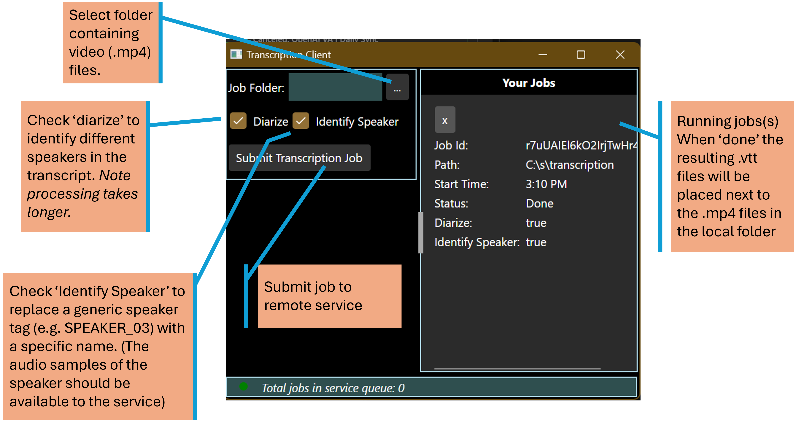

Updates:

- 1/27/2026 - Rev packages and move to .Net 10

# Transcription and Diarization

Wraps a few open source models to transcribe, diarize and optionally tag a specific speaker.

Briefly,
- Transcribe: Extract the audio from video (.mp4) files and convert the audio to text (speed-to-text).

- Diarize: Adds speaker tags to the transcript for multiple speakers in the source file. The speaker tags are generic markers, e.g. SPEAKER_01, SPEAKER_02, etc.

- Speaker Identification: Replaces one of the generic speaker tags with a configured speaker name. This is done by matching the audios of the source file speakers to saved audio samples of the configured speaker.

# Models
- [Fast Transcriber](https://github.com/Purfview/whisper-standalone-win) - transcription and diarization
- [Pyannote](https://huggingface.co/deepghs/pyannote-embedding-onnx) -  audio embedding model for speaker identification

# Solution Projects
### TranscriptionServiceHost
An F# windows service that exposes a SignalR connection to process transcription requests. The service queues incoming 'jobs' and processes them serially. The client is notified when the job is done.

Transcription, diarizaton and speaker identification are compute intensive and so the service is meant to run on a GPU-enabled machine. The intent is to increase the utilization of the GPU infrastructure by making it more easily shareable.

### TranscriptionClient
An F# GUI application to submit jobs to the service. The client uploads the .mp4 files to the service and triggers the processing. When server processing is complete, the client downloads the transcript (.vtt) files.

[Client UI - built with Avalnoia FuncUI](https://github.com/fsprojects/Avalonia.FuncUI)

The client uses SSH protocol for secure data exchange. And uploaded files are deleted by the service after the job is complete.

### TranscriptionService
Contains core logic for transcription and diarization.
Also contains the script [ExtractSpeakerEmbeddings.fsx](/TranscriptionService/scripts/ExtractSpeakerEmbeddings.fsx) that can be used to extract the audio embeddings for speaker identification.

### TranscriptionInterop
Common definitions shared between client and server

### TranscriptionAndDiarization
Older project that contains batch scripts that were used to develop and refine the transcription processing.

# Configuration
The TranscriptionClient is meant to connect to the remote service (running on a GPU box) via SSH and SCP. The SSH connection, with port forwarding, is used for SignalR. The SCP protocol is used for upload/download of files.

The user id and password required for an SSH/SCP connection are stored in appsettings.json. For this reason *appsettings.json is excluded from the repo*. Instead **appsettings.json.template** is provided that contains the 'schema' of the settings. Copy the template file to appsettings.json and configure it appropriately for your setup.
